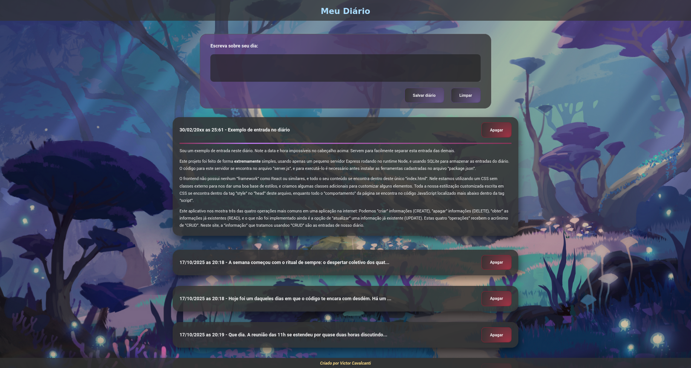

# Exemplo simples de diário virtual
Exemplo simples para apresentação de palestra para potenciais alunos do ensino médio-técnico. Usado para demonstrar um pouco do funcionamento de uma aplicação web simples e despertar curiosidade por algumas dasdiversas possibilidades.

Para download e execução do projeto execute os comandos abaixo em um terminal compatível com comandos simples do Bash:

1. git clone https://github.com/VicCAlq/exemplo-diario.git
2. cd exemplo-diario
3. npm install
4. npm run dev

No navegador, abra o endereço `http://localhost:3000/`
Se tudo estiver correto, você deve conseguir ver o site abaixo:

Na caixa de texto do início da página é possível escrever qualquer conteúdo para um diário. O "título" é gerado automaticamente a partir do início do conteúdo, e a data é automaticamente gerada a partir do momento que o texto é enviado ao servidor.

O servidor já dispõe do código necessário para a implementação de um "editar diário" no cliente. A implementação fica a cargo do aluno.

